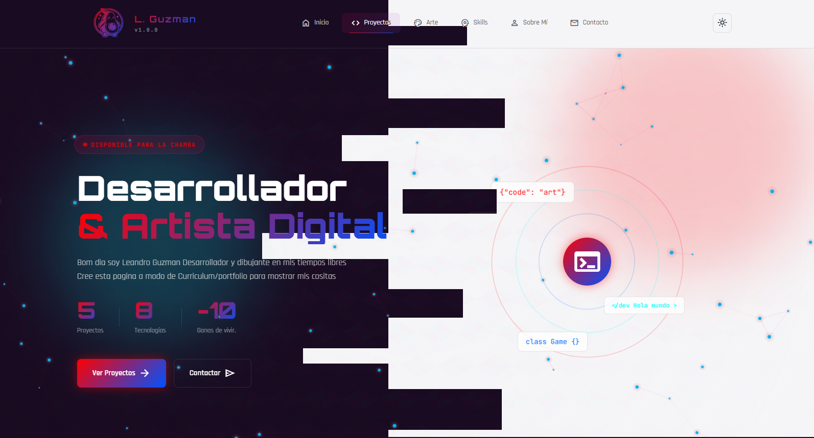

# 🎨 Portfolio Interactivo - Leandro Guzman

Portfolio web moderno e interactivo que combina desarrollo de software y arte digital con efectos visuales avanzados, sistema de partículas y animaciones fluidas.


---

## 📋 Tabla de Contenidos

- [Características](#-características)
- [Demo](#-demo)
- [Tecnologías](#️-tecnologías)
- [Estructura del Proyecto](#-estructura-del-proyecto)
- [Instalación](#-instalación)
- [Configuración](#️-configuración)
- [Uso](#-uso)
- [Personalización](#-personalización)
- [Secciones](#-secciones)
- [Easter Eggs](#-easter-eggs)
- [Optimización](#-optimización)
- [Navegadores Soportados](#-navegadores-soportados)
- [Contribuir](#-contribuir)
- [Contacto](#-contacto)

---

## ✨ Características

### 🎯 Funcionalidades Principales

- **Navegación Suave**: Sistema de SPA (Single Page Application) con transiciones animadas
- **Sistema de Partículas**: Canvas interactivo con partículas que responden al mouse
- **Tema Claro/Oscuro**: Cambio de tema con persistencia en localStorage
- **Galería de Arte**: Modal con zoom, drag y soporte para pixel art
- **Filtros Dinámicos**: Filtrado de proyectos y arte por categorías
- **Responsive Design**: Totalmente adaptable a todos los dispositivos
- **Animaciones Avanzadas**: Scroll animations, hover effects y transiciones suaves
- **Easter Eggs**: Código Konami y efectos especiales ocultos 🎮

### 🚀 Rendimiento

- Lazy loading de imágenes
- Intersection Observer para animaciones
- Optimización de Canvas para 60fps
- Prefetch de recursos en hover
- CSS optimizado con variables nativas

---

## 🎬 Demo

🔗 **[Ver Demo en Vivo](https://github.com/LeaGuz95/LgPage)** 



---

## 🛠️ Tecnologías

### Frontend
- **HTML5**: Semántico y accesible
- **CSS3**: Variables CSS, Grid, Flexbox, Animations
- **JavaScript (ES6+)**: Vanilla JS, POO, Modules

### Fuentes
- **Orbitron**: Títulos y headings
- **Rajdhani**: Texto principal
- **JetBrains Mono**: Código y monospace
- **Material Symbols**: Iconografía

### APIs
- Canvas API (sistema de partículas)
- Intersection Observer API (animaciones)
- Local Storage API (preferencias)

---

## 📁 Estructura del Proyecto

```
portfolio/
├── index.html                 # Estructura principal
├── README.md                  # Documentación
│
├── css/
│   └── styles.css            # Estilos completos (variables, componentes, responsive)
│
├── js/
│   ├── main.js               # Lógica principal (navegación, tema, filtros)
│   ├── particles.js          # Sistema de partículas Canvas
│   ├── data.js               # Configuración de contenido (proyectos, arte)
│   └── contenidoDinamico.js  # Cargador dinámico de contenido
│
└── assets/
    └── images/
        ├── proyectos/        # Screenshots de proyectos
        ├── arte/
        │   ├── FanArts/      # Fan arts digitales
        │   ├── PixelArt/     # Pixel art y assets
        │   └── original/     # Arte original
        └── logo-puchaino.svg # Logo principal
```

---

## 🚀 Instalación

### Opción 1: Descarga Directa

```bash
# Clonar el repositorio
git clone https://github.com/LeaGuz95/LgPage

# Navegar al directorio
cd LgPage


```


---

## ⚙️ Configuración

### 1. Datos del Portfolio (`js/data.js`)

Este archivo centraliza **todo** el contenido del portfolio:

```javascript
const portfolioData = {
    // Proyectos
    projects: [
        {
            title: "Nombre del Proyecto",
            category: "web", // web, software, games, mobile , o lo que se te cante
            description: "Descripción breve",
            image: "assets/images/proyectos/imagen.png",
            technologies: ["JavaScript", "CSS3"],
            github: "https://github.com/usuario/repo",
            demo: "https://demo.com",
            featured: true
        }
    ],
    
    // Galería de Arte
    artGallery: [
        {
            title: "Título de la obra",
            description: "Descripción",
            image: "assets/images/arte/obra.png",
            category: "fanart", // fanart, pixelart, original , o lo que se te cante
            year: 2025
        }
    ],
    
    // Imagen placeholder
    placeholder: "data:image/svg+xml,..."
};
```

### 2. Colores y Tema (`css/styles.css`)

Variables CSS en `:root`:

```css
:root {
    /* Colores principales */
    --color-bg-primary: #190b21;
    --color-accent-primary: #ff0000;
    --color-accent-secondary: #00FFFF;
    
    /* Gradientes */
    --gradient-primary: linear-gradient(135deg, #ff0000 0%, #0051ff 100%);
    
    /* Tipografía */
    --font-heading: 'Orbitron', sans-serif;
    --font-primary: 'Rajdhani', sans-serif;
}
```

### 3. Sistema de Partículas (`js/particles.js`)

Configuración personalizable:

```javascript
class ParticleSystem {
    constructor(canvasId) {
        this.particleCount = 80;      // Cantidad de partículas
        this.maxDistance = 120;       // Distancia máxima de conexión
        this.mouse.radius = 150;      // Radio de interacción del mouse
    }
}
```

---

## 📖 Uso

### Navegación

El portfolio funciona como una SPA con 6 secciones principales:

```javascript
// Las secciones se cargan sin recargar la página
Inicio → Proyectos → Arte → Skills → Sobre Mí → Contacto
```

### Filtros

**Proyectos**: Filtra por `all`, `software`, `games`, `web`
**Arte**: Filtra por `all`, `fanart`, `pixelart`, `original`

### Tema

Click en el botón de tema (sol/luna) para alternar:
- Tema oscuro (default)
- Tema claro
- Preferencia guardada en localStorage

### Galería de Arte

- **Click** en imagen: Abre modal
- **Scroll del mouse**: Zoom in/out
- **Click y arrastrar**: Mover imagen
- **ESC**: Cerrar modal
- **Click fuera**: Cerrar modal

---

## 🎨 Personalización

### Agregar un Proyecto

En `js/data.js`:

```javascript
portfolioData.projects.push({
    title: "Mi Nuevo Proyecto",
    category: "web",
    description: "Descripción del proyecto",
    image: "assets/images/proyectos/nuevo-proyecto.png",
    technologies: ["React", "Node.js", "MongoDB"],
    github: "https://github.com/usuario/proyecto",
    demo: "https://proyecto-demo.com",
    featured: true
});
```

### Agregar Arte

En `js/data.js`:

```javascript
portfolioData.artGallery.push({
    title: "Nueva Obra",
    description: "Descripción de la obra",
    image: "assets/images/arte/nueva-obra.png",
    category: "original",
    year: 2025
});
```

### Modificar Colores

En `css/styles.css`, cambia las variables:

```css
:root {
    --color-accent-primary: #tu-color-aqui;
    --gradient-primary: linear-gradient(135deg, #color1, #color2);
}
```

### Cambiar Información Personal

Edita directamente en `index.html`:

```html
<!-- Hero Section -->
<h1 class="hero-title">
    <span class="title-line">Tu Título</span>
</h1>

<!-- Contact -->
<a href="mailto:tu-email@gmail.com">
```

---

## 📱 Secciones

### 1️⃣ Home
- Hero con animación
- Estadísticas animadas
- CTAs principales
- Efectos visuales con anillos giratorios

### 2️⃣ Proyectos
- Grid responsive de proyectos
- Filtros por categoría
- Overlay con links a GitHub/Demo
- Cards con hover effects

### 3️⃣ Arte
- Galería masonry adaptativa
- Modal con zoom y drag
- Soporte para pixel art (crisp edges)
- Categorías: Fan Art, Pixel Art, Original

### 4️⃣ Skills
- Categorías: Lenguajes, Conceptos, Herramientas
- Barras de progreso animadas
- Icons y SVGs personalizados
- Hover effects en cada skill

### 5️⃣ Sobre Mí
- Bloques de texto
- Timeline vertical animado
- Tags de intereses
- Historia profesional

### 6️⃣ Contacto
- Métodos de contacto con links
- Formulario (mockup)
- Redes sociales
- Footer con información

---

## 🎮 Easter Eggs

### Código Konami
Secuencia: `↑ ↑ ↓ ↓ ← → ← → B A`

**Efecto**: 
- Lluvia de 50 imágenes de Puchaino
- Overlay rainbow giratorio
- Sonido especial

### Click en el Logo
Click en el logo de Puchaino (navbar):

**Efecto**:
- Cae una imagen animada
- Reproduce sonido
- Efecto de escala en el logo

### Mensaje en Consola
Abre DevTools (F12) para ver el mensaje de bienvenida con arte ASCII.

---

## ⚡ Optimización

### Rendimiento Implementado

- **Lazy Loading**: Imágenes cargadas bajo demanda
- **Debouncing**: En scroll y resize events
- **RequestAnimationFrame**: Para animaciones suaves
- **CSS containment**: Para mejorar rendering
- **Prefetch**: Links importantes precargados

### Métricas Objetivo

- **First Contentful Paint**: < 1.5s
- **Time to Interactive**: < 3.5s
- **Largest Contentful Paint**: < 2.5s
- **Cumulative Layout Shift**: < 0.1

### Optimizaciones Adicionales Recomendadas

```bash
# Minificar CSS
npx clean-css-cli -o styles.min.css styles.css

# Minificar JS
npx terser main.js -o main.min.js

# Optimizar imágenes
npx imagemin assets/images/* --out-dir=assets/images-optimized
```

---

## 🌐 Navegadores Soportados

| Navegador | Versión Mínima |
|-----------|----------------|
| Chrome    | 90+            |
| Firefox   | 88+            |
| Safari    | 14+            |
| Edge      | 90+            |
| Opera     | 76+            |

**Características Modernas Usadas**:
- CSS Grid & Flexbox
- CSS Variables
- Intersection Observer
- Canvas API
- ES6+ (Classes, Arrow Functions, Template Literals)
- Local Storage

---

## 🤝 Contribuir

Las contribuciones son bienvenidas. Para cambios importantes:

1. Fork el proyecto
2. Crea una rama para tu feature (`git checkout -b feature/AmazingFeature`)
3. Commit tus cambios (`git commit -m 'Add some AmazingFeature'`)
4. Push a la rama (`git push origin feature/AmazingFeature`)
5. Abre un Pull Request

### Áreas de Mejora

- [ ] Backend para formulario de contacto
- [ ] Modo de accesibilidad mejorado
- [ ] PWA (Progressive Web App)
- [ ] i18n (internacionalización)
- [ ] Tests unitarios

---


## 📞 Contacto

**Leandro Guzman**

- 📧 Email: [ljgp2395@gmail.com](mailto:ljgp2395@gmail.com)
- 💼 LinkedIn: [leandro-guzman23](https://www.linkedin.com/in/leandro-guzman23/)
- 🐙 GitHub: [LeaGuz95](https://github.com/LeaGuz95)
- 🎨 DeviantArt: [theguzyo](https://www.deviantart.com/theguzyo)
- 📸 Instagram: [leaguz23](https://www.instagram.com/leaguz23/)
- 🐦 X/Twitter: [theguzyo](https://x.com/theguzyo)

---

## 🙏 Agradecimientos

- **Fuentes**: Google Fonts
- **Iconos**: Material Symbols
- **Inspiración**: Comunidad de desarrolladores y artistas
- **Herramientas**: VS Code, Git, GitHub

---

## 📊 Estadísticas del Proyecto

```
📁 Total de archivos: ~15
📝 Líneas de código: ~3,500
🎨 Proyectos mostrados: 8
🖼️ Obras de arte: 70+
⚡ Tecnologías usadas: 7+
```

---

## 🗺️ Roadmap

### v1.1.0 (Próximamente)
- [ ] Backend con Node.js para contacto
- [ ] Integración con GitHub API
- [ ] Analytics básico

### v1.2.0 (Futuro)
- [ ] Blog integrado
- [ ] Modo offline (PWA)
- [ ] Animaciones con GSAP

### v2.0.0 (Visión)
- [ ] Dashboard de administración
- [ ] CMS personalizado
- [ ] Multi-idioma

---

<div align="center">

**⭐ Si te gustó el proyecto, considera darle una estrella en GitHub ⭐**

Hecho con ❤️ y ☕ por [Leandro Guzman](https://github.com/LeaGuz95)

[⬆ Volver arriba](#-portfolio-interactivo---leandro-guzman)

</div>
