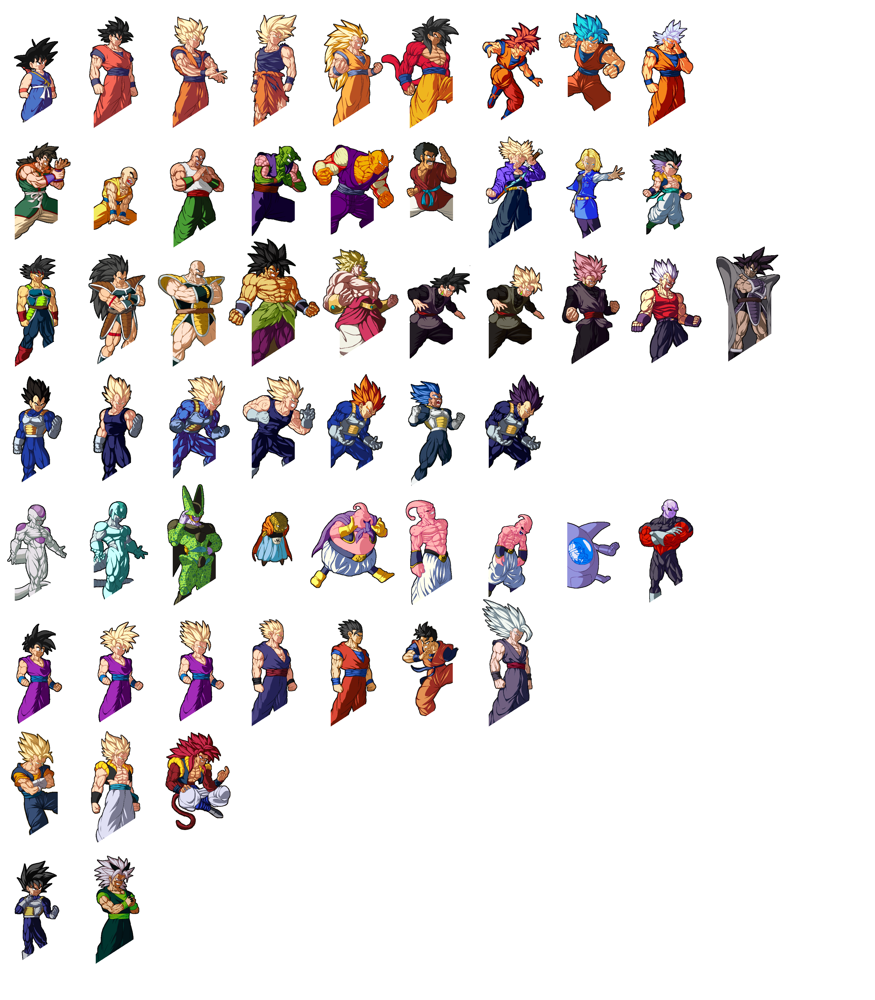
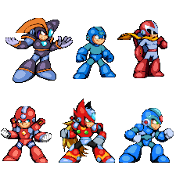
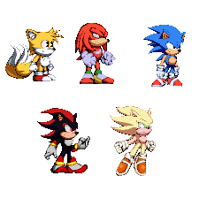
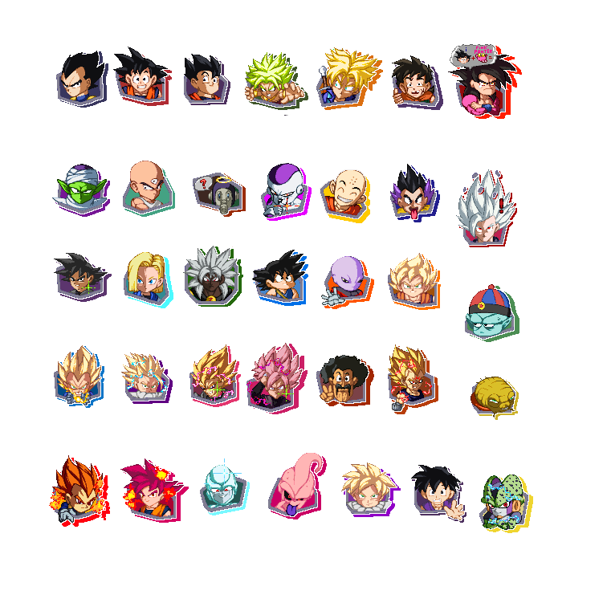
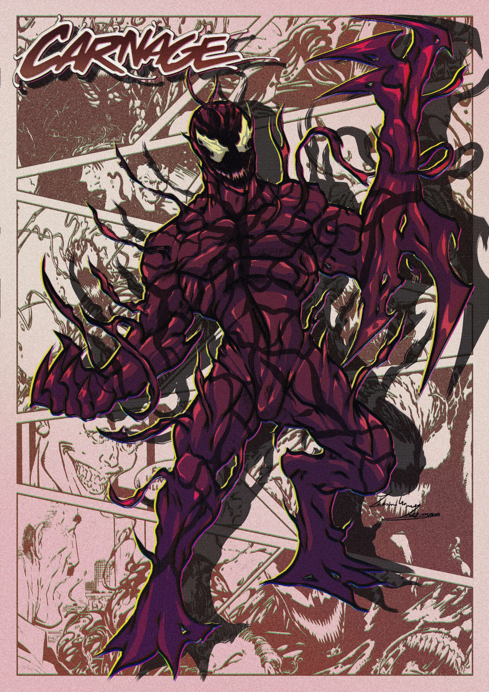
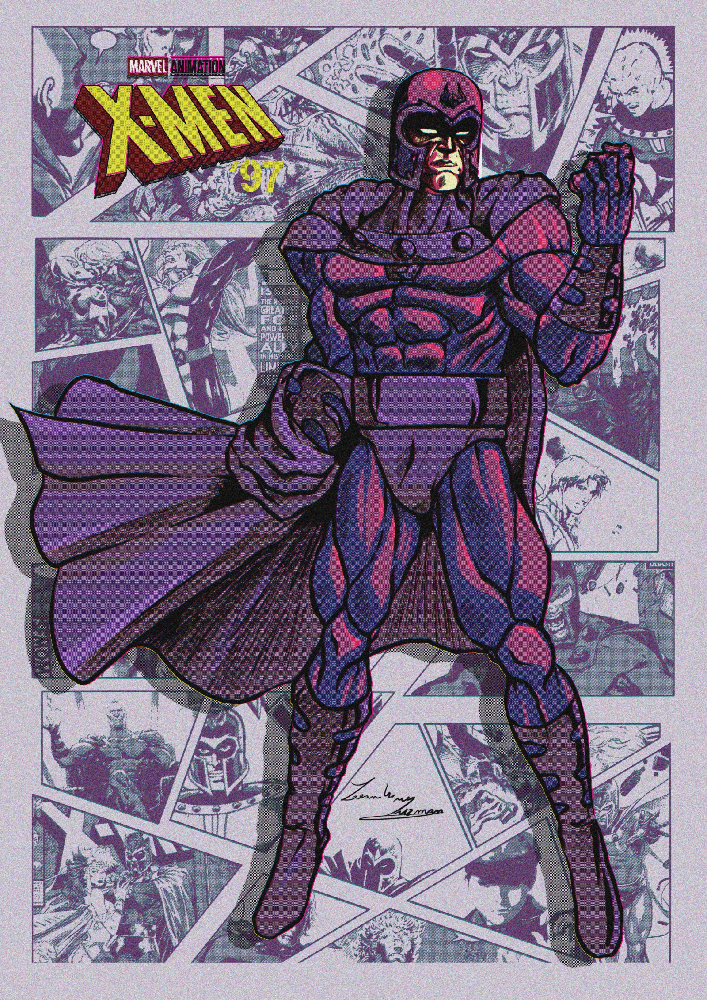
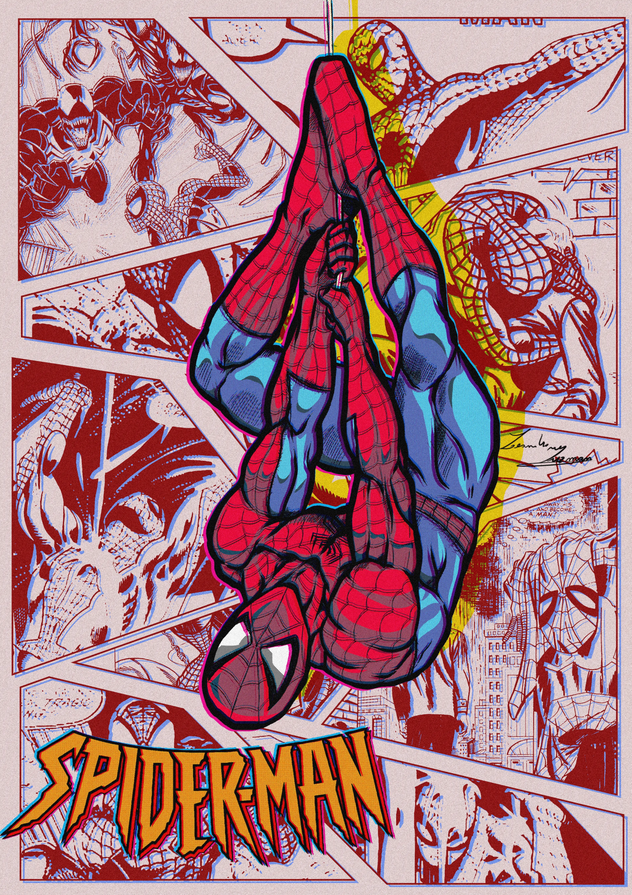

# Moodboard – Sitio web estilo Pixel Art / Comic

## Objetivo
Página web visualmente llamativa, inspirada en videojuegos clásicos y cómics,
con foco en estética retro, colorida y expresiva.

## Público
Usuarios generales, gamers y personas afines a la cultura pop, retro y pixel art.
No técnico.

## Estilo visual general
- Pixel art
- Estilo cómic
- Retro / arcade
- Colores fuertes y contrastados
- Diseño expresivo antes que minimalista

## Influencias claras
- Videojuegos 2D clásicos (Mega Man, Sonic)
- Sprites de pelea estilo arcade (DBZ, MUGEN)
- Arte cómic (Marvel, X-Men, Spider-Man)
- UI con personalidad visual marcada

## Prohibiciones
- Diseño minimalista moderno
- Paletas apagadas o monocromáticas
- Glassmorphism
- Gradientes suaves tipo SaaS
- Tipografías corporativas genéricas

## Referencias visuales

### Pixel Art – Personajes

Motivo: proporciones claras, siluetas fuertes y lectura inmediata en tamaños chicos.

Motivo: estilo pixel art limpio, colores sólidos y estética retro coherente.

Motivo: personaje icónico con identidad visual fuerte y paleta vibrante.

### Iconografía / UI

Motivo: iconos expresivos, bordes definidos y estilo caricaturesco.

### Estilo Cómic

Motivo: líneas marcadas, alto contraste y dramatismo visual.

Motivo: composición tipo portada de cómic y uso de tramas.

Motivo: narrativa visual, colores saturados y estética cómic clásica.

## Paleta de color (orientativa)
- Rojo intenso
- Azul saturado
- Amarillo fuerte
- Negro puro para contraste
- Blanco limitado para respiro visual

## Sensaciones que debe transmitir
- Energía
- Diversión
- Identidad fuerte
- Nostalgia retro
- Estilo arcade / cómic

## Prioridad
Identidad visual > sobriedad
Expresividad > neutralidad

CONTEXTO VISUAL DEL PROYECTO (OBLIGATORIO)

La identidad visual del sitio es:

- Estilo pixel art + cómic
- Inspirado en videojuegos 2D arcade de los 90
- Inspirado en sprites de pelea y arte cómic clásico
- Colores saturados, primarios y secundarios
- Alto contraste
- Contornos visibles y marcados
- UI expresiva, con personalidad fuerte
- Estética retro / arcade

Reglas visuales:
- Botones con bordes gruesos, aspecto “presionable”
- Cards con marco visible (tipo viñeta de cómic)
- Iconos tipo sticker o sprite
- Tipografías con carácter (pixel / comic / arcade)

PROHIBIDO:
- Minimalismo moderno
- Estilo SaaS
- Glassmorphism
- Gradientes suaves
- Paletas apagadas o monocromáticas
- Tipografías finas o corporativas

PRIORIDAD:
Identidad visual > sobriedad
Expresividad > neutralidad
